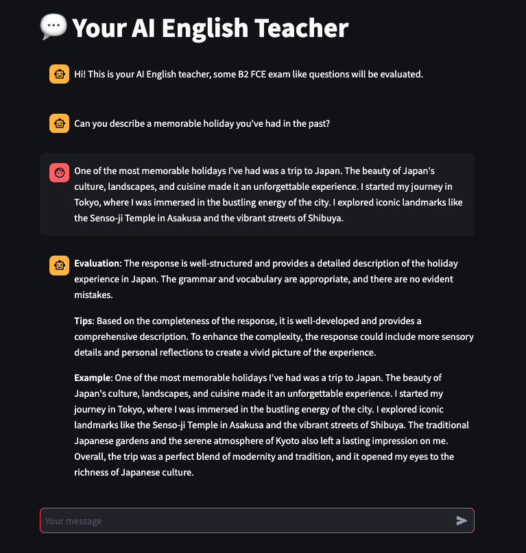
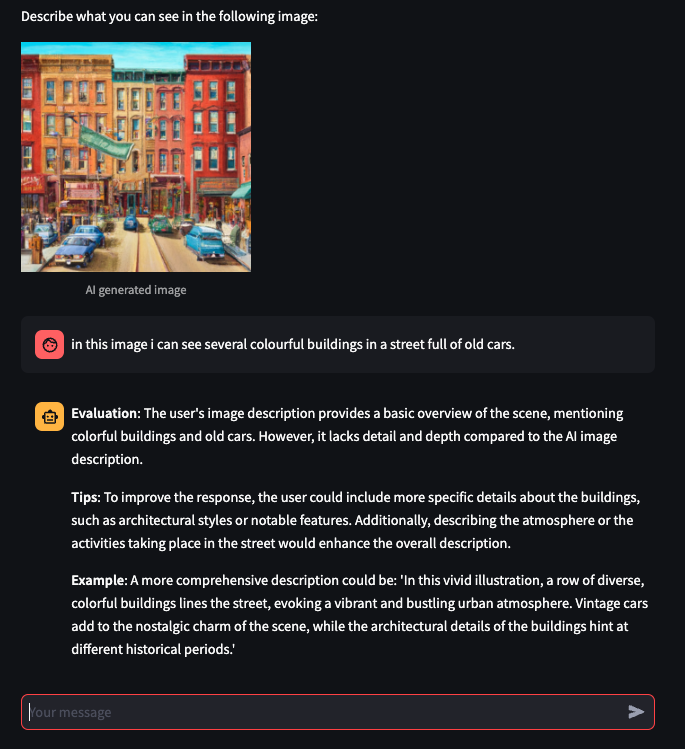

# LinguAIcoach


Yo can access to the App through: [LinguAIcoach Web](https://linguaicoach.streamlit.app/)

## Description
LinguAIcoach is a project that helps to improve your English with the assistance of AI. It provides tools for practicing, testing, and learning English using AI chatbots and other language processing technologies. The LinguAIcoach project utilizes DALL-E, GPT-4V, Whisper and GPT models to enhance English language learning in a multimodal way. The project offers a variety of exercises to enhance your English skills. The exercises cover different types of exams.

At this moment, First Cambridge Exam (FCE) has been the reference exam used for the proposed exercises. In particular, speaking exercises have been adapted to a chatbot environment.
- B2 - FCE: Speaking QA: This covers questions answering exercises of Speaking in B2 - FCE.
- B2 - FCE: Speaking Img Desc: This covers image description exercises in B2 - FCE.
- B2 - FCE: Speaking Opinion: This covers opinion question exercises in B2 - FCE.

Each exercise is designed to help you practice and improve your English skills in specific areas. The exercises are based on real-life exam questions and provide a hands-on experience to help you improve your English proficiency.

The input can be inserted either through text input or voice input which will be processed with Whisper to get its transcription.

After answering, the response will be evaluated based on its grammar syntaxis and complexity and the following fields will be returned:
- Evaluation: This field summarizes the evaluation of the response. This is where it is detailed how well the response matches the expected criteria.
- Tips: Provides tips about complexity and detailed mistakes correction. This is where you can give guidance on how to improve responses or correct mistakes.
- Example: This field provides an example of a response. It showcases how an ideal response should look like.

### Question Answering Exercises Example


### Image Description Exercises Example


## Local Installation
To install this project, you will need to have Python 3.11, Poetry and poethepoet installed. Then, you can clone the repository and run `poe setup` to install the required dependencies.

If you would like to use langsmith with this project I recommend you to create a .env file with the following values:
```
LANGCHAIN_API_KEY="your-langsmith-api-key"
LANGCHAIN_TRACING_V2=true
LANGCHAIN_ENDPOINT="https://api.smith.langchain.com"
LANGCHAIN_PROJECT="your-project-name-from-langsmith"
OPENAI_API_KEY="your-openai-api-key"
```

After installing the project, you can run the main application using the command `poe start`. This will start the Streamlit application, which provides a user interface for interacting with the AI English teacher.

## Usage
You will need to provide an [OpenAI API Key](https://platform.openai.com/account/api-keys) in the interface or in the .env file like explained above.

Exercises are defined in exam_guides/lessons.json file. The amount of exercises will be expanded in future releases. The .txt files in exam_guides are examples of what it is expected in each kind of exercise. In future releases this will be used for generating examples for reference in Langchain.

## Contributing
If you would like to contribute to this project, please fork the repository, make your changes, and submit a pull request. Your contributions are welcome!

## License
This project is licensed under the CC-BY-NC-ND-4.0 license. See the [LICENSE.md](LICENSE.md) file for more details.

## Authors
- [alvaroalon2](https://github.com/alvaroalon2)

## Next Steps
- New kind of exercises.
- Guide content generation using examples extracted from real exams.
- Testing
